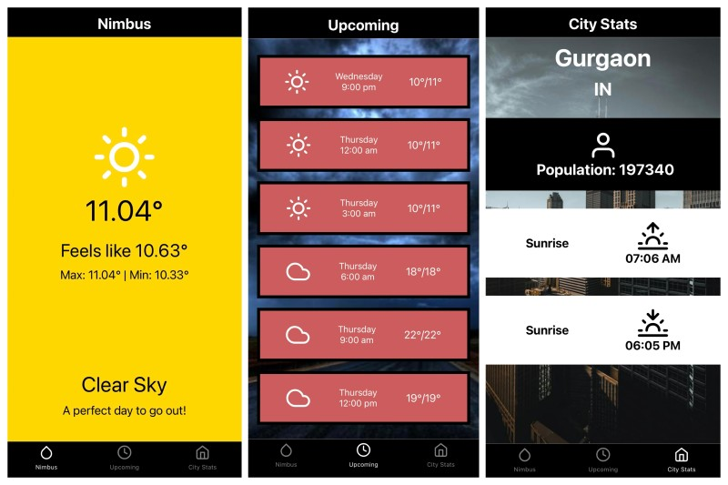

# Nimbus Weather App

Nimbus is a simple weather application built with React Native, serving as a learning project to get familiar with React Native basics and OpenWeather API integration.

## Preview



## Features

- **Current Weather:** View current weather conditions including temperature, humidity, wind speed, and more.
- **Upcoming Weather:** Access forecast for the upcoming days to plan ahead.
- **City Weather:** Get more detailed weather information for your city based on your location.

## Installation

1. Clone the repository

    ```bash
    git clone https://github.com/yodkwtf/nimbus-react-native.git
    ```

2. Navigate to the project directory

    ```sh
    cd nimbus-react-native
    ```

3. Install dependencies

    ```sh
    npm install
    ```

4. Start the application

    ```sh
    npm start
    ```

5. Follow the instructions in the terminal to launch the app on your preferred device/emulator.

## OpenWeather API Integration

Nimbus uses the OpenWeather API to fetch weather data. To use this app, you'll need to obtain an API key by signing up on the [OpenWeather website](https://openweathermap.org/). Once you have the API key, create a file named `.env` in the project root and add the following:

```.env
WEATHER_API_KEY=your_api_key
```

Replace `your_api_key` with your actual API key.

## Contributing

Contributions are welcome! Please create an issue or pull request if you would like to contribute to this project.

## Acknowledgements

- [OpenWeather API](https://openweathermap.org/)
- [React Native](https://reactnative.dev/)
- [Expo](https://expo.io/)

## Contact

- **Email:** [48durgesh.kumar@gmail.com](mailto:48durgesh.kumar@gmail.com)
- **LinkedIn:** [Durgesh Kumar](https://www.linkedin.com/in/durgesh-chaudhary/)
- **GitHub:** [@yodkwtf](https://github.com/yodkwtf)
